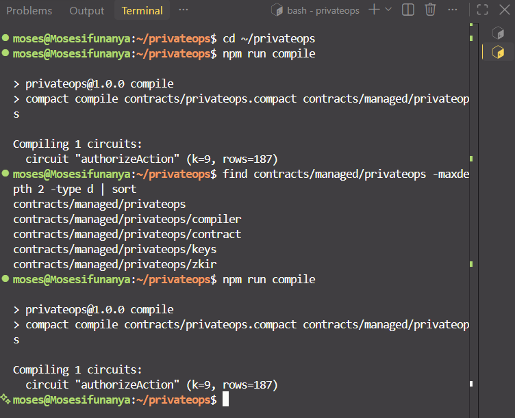
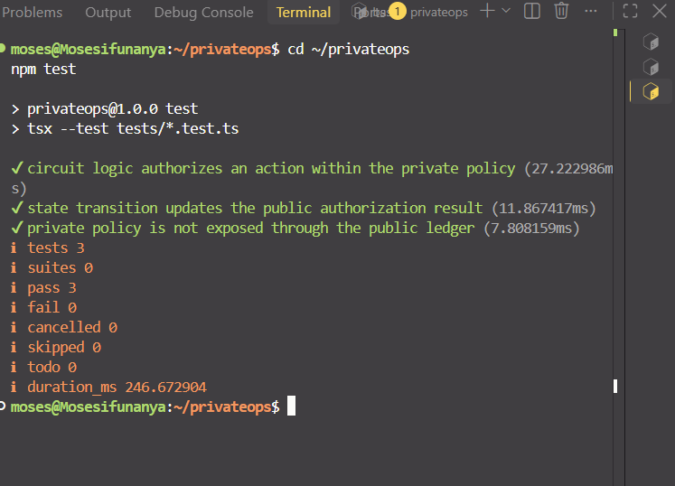
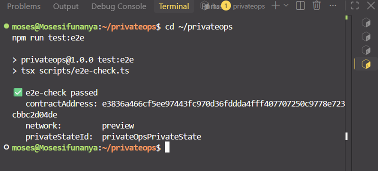

# PrivateOps

> Verify what AI agents are allowed to do, without exposing private rules.

PrivateOps is a privacy preserving authorization and verification prototype built on Midnight. It demonstrates how an AI agent or application can prove that an action follows a private authorization policy without exposing the policy itself.

## Contract Address

| Network | Address |
|---|---|
| Preview | `e3836a466cf5ee97443fc970d36fddda4fff407707250c9778e723cbbc2d04de` |
| Preprod | Not deployed |

The Level 1 PrivateOps contract is deployed to Midnight Preview.

## What This Does

PrivateOps addresses a simple authorization problem: an AI agent may need to perform a sensitive action, but the rule used to authorize that action may itself be private.

For Level 1, the project uses a private policy limit.

Example:

```text
Private Policy Limit: 500
Action Amount:        300
Authorization Result: AUTHORIZED
```

If the requested amount exceeds the private policy:

```text
Private Policy Limit: 500
Action Amount:        700
Authorization Result: NOT AUTHORIZED
```

The policy limit is supplied as a private witness value. The contract deliberately discloses the action amount and authorization result while keeping the policy limit out of the public ledger.

## Problem

AI agents are increasingly being trusted to perform actions involving sensitive information and valuable resources.

Traditional authorization systems can require an application to reveal or expose the rules used to make an authorization decision.

For example, an organization may have an internal rule that an AI agent can approve expenses only up to a certain limit. The organization may want to prove that a particular action was authorized without publicly revealing that internal limit.

PrivateOps explores this privacy preserving authorization model using Midnight Compact smart contracts and zero knowledge proofs.

## Solution

PrivateOps separates authorization information into public and private components.

The private policy is supplied through a local witness. The Compact circuit compares the requested action against the private policy and produces a public authorization result.

```text
User / AI Agent
      |
      | Action Request
      v
Private Policy
      |
      | Private Witness
      v
PrivateOps Compact Contract
      |
      | Zero Knowledge Proof
      v
Authorization Decision
      |
      | Deliberate disclosure
      v
Public Ledger Result
```

## Core Idea

The core idea is:

> An AI agent should be able to prove that an action follows a private authorization rule without exposing the rule itself.

The Level 1 implementation evaluates:

```text
actionAmount <= policyLimit
```

The action amount and authorization result become public ledger state through deliberate `disclose()` calls.

The private policy limit remains private.

## Initial Idea

PrivateOps started from the idea that AI agents will increasingly perform sensitive actions on behalf of users and organizations.

The project explores whether those agents can operate under private authorization policies while still producing verifiable authorization results.

The first Level 1 implementation uses a private spending limit as the policy example. A policy limit such as `500` remains private, while an action such as `300` can be verified as authorized.

Future versions can extend this model to more complex policies, agent identity, organizational permissions, spending controls, and other privacy sensitive workflows.

## Privacy Model

PrivateOps divides information into three categories.

### Public

The contract exposes the following public ledger state:

```text
lastActionAmount
lastActionAuthorized
```

These values are deliberately disclosed.

### Private

The policy is supplied through the private witness:

```text
getPolicyLimit()
```

The corresponding policy limit is maintained in private application state and is not stored as public ledger state.

### Proven Without Revealing

The circuit proves the relationship:

```text
actionAmount <= policyLimit
```

The authorization result can therefore be disclosed without publishing the private policy limit itself.

## Smart Contract

The main Compact contract is:

```text
contracts/privateops.compact
```

The contract contains public ledger state:

```compact
export ledger lastActionAmount: Uint<64>;
export ledger lastActionAuthorized: Boolean;
```

It also defines the private witness:

```compact
witness getPolicyLimit(): Uint<64>;
```

The main authorization circuit is:

```compact
export circuit authorizeAction(actionAmount: Uint<64>): [] {
    const policyLimit = getPolicyLimit();

    const authorized = actionAmount <= policyLimit;

    lastActionAmount = disclose(actionAmount);
    lastActionAuthorized = disclose(authorized);
}
```

The contract deliberately discloses only the values intended to be public.

## Level 1 Contract Requirements

| Requirement | PrivateOps implementation |
|---|---|
| Public ledger state | `lastActionAmount`, `lastActionAuthorized` |
| Private witness | `getPolicyLimit()` |
| Deliberate `disclose()` | Action amount and authorization result |
| Public/private explanation | Comments in `contracts/privateops.compact` |
| Circuit logic | `authorizeAction()` |
| Generated managed directory | `contracts/managed/privateops/` |
| Automated tests | `tests/privateops.test.ts` |
| Deployment | Midnight Preview |

## Architecture

```text
+-----------------------------+
|        User / Agent         |
+--------------+--------------+
               |
               | Action Request
               v
+-----------------------------+
|       PrivateOps CLI        |
+--------------+--------------+
               |
               | Private Policy
               v
+-----------------------------+
|       Private Witness       |
|       getPolicyLimit()      |
+--------------+--------------+
               |
               v
+-----------------------------+
|     Compact Smart Contract  |
|     authorizeAction()       |
+--------------+--------------+
               |
               | Zero Knowledge Proof
               v
+-----------------------------+
|       Midnight Network      |
+--------------+--------------+
               |
               v
+-----------------------------+
|      Public Ledger State    |
|  lastActionAmount           |
|  lastActionAuthorized       |
+-----------------------------+
```

## Tech Stack

- Midnight Network
- Compact
- Compact Standard Library
- Node.js v22
- TypeScript
- npm
- Docker
- Midnight Proof Server
- Midnight Compact Runtime
- Midnight Wallet SDK
- Midnight Preview Network
- Git
- GitHub

## Prerequisites

The project requires:

- Node.js v22
- npm
- Docker Desktop
- WSL2 when developing on Windows
- Midnight Compact compiler
- Midnight Compact CLI
- Git
- A Midnight wallet for deployment
- Access to Midnight Preview or Preprod
- A funded deployment wallet
- Midnight proof server

Verify the local toolchain:

```bash
node --version
npm --version
docker --version
compact --version
```

## Setup

Clone the repository:

```bash
git clone https://github.com/mosesifunanya/privateops.git
```

Enter the project directory:

```bash
cd privateops
```

Install dependencies:

```bash
npm install
```

Start the proof server:

```bash
npm run proof-server:start
```

Run project setup:

```bash
npm run setup
```

## Compile the Contract

Compile the PrivateOps contract:

```bash
npm run compile
```

The project compile script runs:

```text
compact compile contracts/privateops.compact contracts/managed/privateops
```

A successful compilation generates:

```text
contracts/managed/privateops/
├── compiler/
├── contract/
├── keys/
└── zkir/
```

The generated managed directory contains the compiled contract artifacts and zero knowledge related artifacts used by the application.

## Run Tests

Run the Level 1 test suite:

```bash
npm test
```

The test suite contains 3 tests covering the required Level 1 areas:

1. Circuit logic
2. State transitions
3. Protection of private inputs

Expected result:

```text
tests 3
pass 3
fail 0
```

Run TypeScript validation:

```bash
npx tsc --noEmit
```

Run end to end verification:

```bash
npm run test:e2e
```

## Test Coverage

### Circuit Logic

The first test verifies that an action within the private policy is authorized.

Example:

```text
300 <= 500
```

Expected result:

```text
Authorized = true
```

### State Transitions

The second test verifies that public authorization state changes correctly when the contract processes different actions.

Example:

```text
300 -> Authorized
700 -> Not Authorized
```

### Private Input Protection

The third test verifies that the public ledger does not expose the private policy or witness function.

The public ledger contains only:

```text
lastActionAmount
lastActionAuthorized
```

The policy value itself is not part of the public ledger.

## Deployment

PrivateOps was deployed as the custom Level 1 contract rather than the original Hello World contract.

Deploy to Midnight Preview with:

```bash
npm run deploy -- --network preview
```

### Preview Deployment

```text
Network:
Midnight Preview

Contract Address:
e3836a466cf5ee97443fc970d36fddda4fff407707250c9778e723cbbc2d04de
```

The deployed contract was successfully verified through the project end to end check.

## Authorization Testing

The deployed contract was tested with the Level 1 policy limit.

### Authorized Action

```text
Policy Limit: 500
Action Amount: 300
Result: Authorized
```

### Unauthorized Action

```text
Policy Limit: 500
Action Amount: 700
Result: Not Authorized
```

The policy limit remains private while the action amount and authorization result are deliberately disclosed.

## End to End Verification

Run:

```bash
npm run test:e2e
```

Successful verification reports:

```text
e2e-check passed
contractAddress: e3836a466cf5ee97443fc970d36fddda4fff407707250c9778e723cbbc2d04de
network: preview
privateStateId: privateOpsPrivateState
```

## CLI

Start the PrivateOps CLI:

```bash
npm run cli
```

The CLI provides:

```text
1. Authorize an action
2. Read current authorization result
3. Check wallet balance
4. Show contract address
5. Exit
```

The Level 1 private policy is initialized to:

```text
500
```

## Project Structure

```text
privateops/
├── contracts/
│   ├── privateops.compact
│   └── managed/
│       └── privateops/
│           ├── compiler/
│           ├── contract/
│           ├── keys/
│           └── zkir/
│
├── scripts/
│   ├── clean.mjs
│   └── e2e-check.ts
│
├── src/
│   ├── check-balance.ts
│   ├── cli.ts
│   ├── deploy.ts
│   ├── network.ts
│   ├── setup.ts
│   ├── wallet-state.ts
│   ├── wallet.ts
│   └── witnesses.ts
│
├── tests/
│   └── privateops.test.ts
│
├── docs/
│   └── screenshots/
│       ├── compile-success.png
│       ├── tests-passing.png
│       └── deployment-success.png
│
├── README.md
├── package.json
└── tsconfig.json
```

## Screenshots

The following screenshots provide Level 1 evidence from the actual PrivateOps project.

### Contract Compilation

The compilation evidence shows successful compilation of `contracts/privateops.compact`, the `authorizeAction` circuit, and the generated managed directory.



### Passing Level 1 Tests

The test evidence shows all 3 required tests passing with 0 failures.



### Preview Deployment and Contract Address

The deployment evidence shows successful end to end verification, the Preview network, and the deployed PrivateOps contract address.



> Screenshots must not contain wallet recovery phrases, private keys, or other sensitive credentials.

## Development Commands

Install dependencies:

```bash
npm install
```

Compile:

```bash
npm run compile
```

Start proof server:

```bash
npm run proof-server:start
```

Stop proof server:

```bash
npm run proof-server:stop
```

Setup:

```bash
npm run setup
```

Deploy to Preview:

```bash
npm run deploy -- --network preview
```

Start CLI:

```bash
npm run cli
```

Check wallet balance:

```bash
npm run check-balance
```

Check network:

```bash
npm run network -- --network preview
```

Run tests:

```bash
npm test
```

Run end to end verification:

```bash
npm run test:e2e
```

Clean generated contract artifacts:

```bash
npm run clean
```

## Security Considerations

PrivateOps is a Level 1 prototype for demonstrating privacy preserving authorization.

Never commit wallet recovery phrases, private keys, or wallet credentials to GitHub.

Private policy values should also be protected from accidental exposure in production applications.

The current deployment is on Midnight Preview and is intended for challenge development, testing, and demonstration.

## Current Level 1 Status

The Level 1 implementation currently provides:

- Custom PrivateOps Compact contract
- Public ledger state
- Private policy witness
- Deliberate `disclose()` usage
- Authorization circuit
- Zero knowledge proof based verification
- Generated managed contract artifacts
- 3 automated Level 1 tests
- Passing test suite
- End to end verification
- Midnight Preview deployment
- CLI interaction
- README documentation
- Compile, test, and deployment evidence screenshots

## Level 1 Final Checklist

| Requirement | Status |
|---|---|
| Contract compiles with Compact | Complete |
| `contracts/managed/privateops/` generated | Complete |
| Public ledger state implemented | Complete |
| Private witness implemented | Complete |
| Deliberate `disclose()` used | Complete |
| Public/private comment block included | Complete |
| 3+ tests written | Complete |
| Circuit logic test passing | Complete |
| State transition test passing | Complete |
| Private input protection test passing | Complete |
| All tests passing | Complete |
| Custom contract deployed | Complete |
| Deployed to Midnight Preview | Complete |
| Contract address visible in README | Complete |
| Mandatory README sections included | Complete |
| Compile screenshot added | Complete |
| Tests screenshot added | Complete |
| Deployment/address screenshot added | Complete |
| 5+ meaningful commits | Complete |
| Public GitHub repository | Pending final push |

## Roadmap

### Level 1 — New Moon

Completed:

- Project scaffolding
- Compact smart contract
- Public ledger state
- Private witness
- Authorization circuit
- Zero knowledge proof based verification
- Contract compilation
- Managed artifacts
- Automated tests
- Preview deployment
- CLI interaction
- Documentation
- Evidence screenshots

### Level 2 — Frontend and Wallet

Planned:

- Web interface
- Wallet connection
- Agent identity
- Policy management
- Authorization dashboard
- Transaction history
- Proof and authorization visualization

### Level 3 — Advanced Privacy and Agent Infrastructure

Planned:

- More complex authorization policies
- Multiple policy types
- Agent identity management
- Organization level authorization
- CI/CD
- Additional network deployments
- Production hardening

## Future Use Cases

### AI Agent Spending Controls

Organizations could define private spending policies for autonomous AI agents and verify authorization without exposing internal limits.

### Enterprise Authorization

Businesses could verify authorization decisions while keeping internal authorization rules private.

### Private Procurement

Procurement workflows could verify compliance with private organizational thresholds.

### Agent Permissions

AI agents could prove that an action is permitted by a private permission policy.

### Financial Controls

Financial applications could verify compliance with private authorization rules.

### Privacy Preserving Automation

Automated systems could prove that actions comply with private business rules while maintaining confidentiality.

## Vision

PrivateOps explores a future where AI agents can operate with verifiable permissions without requiring their underlying authorization policies to become public.

Instead of asking:

```text
What is the private rule?
```

the system can focus on:

```text
Can you prove that this action follows the rule?
```

This creates a foundation for privacy preserving authorization for autonomous software agents.

## Contributing

Contributions are welcome.

Potential contribution areas include:

- Compact smart contract development
- Privacy and zero knowledge proof design
- Agent authorization
- Frontend development
- Wallet integration
- Testing
- Security improvements
- Documentation
- Developer tooling
- Midnight ecosystem integrations

## Author

**Moses Ifunanya Nobei**

Blockchain Developer | Full Stack Developer 

GitHub: https://github.com/mosesifunanya

## License

This project is released under the MIT License.

## Project Status

PrivateOps is a working Level 1 Midnight Builder Challenge prototype demonstrating privacy preserving authorization using Compact and Midnight zero knowledge proofs.

The current implementation is intended for learning, experimentation, testing, and Midnight ecosystem development.
